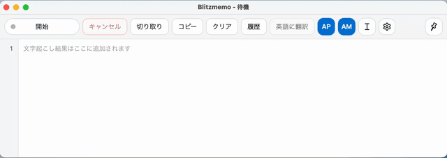
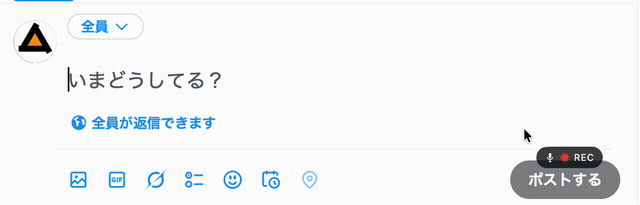
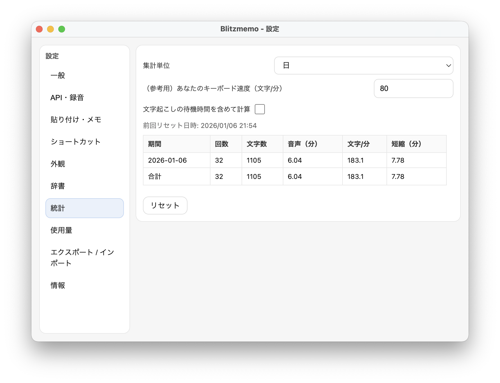
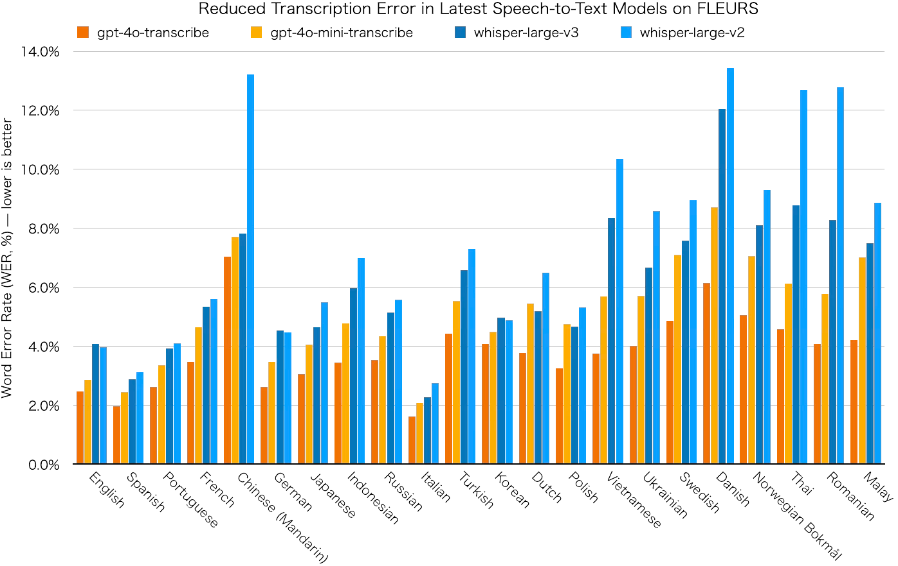

# Blitzmemo

Type faster by speaking. Blitzmemo is voice-to-text software for macOS and Windows, powered by OpenAI’s next-generation speech recognition AI.

## Screenshots

| Memo Mode | Global Mode (Input Everywhere) | Usage Stats |
| --- | --- | --- |
|  |  |  |

- Website: https://blitzmemo.com/
- Download: https://blitzmemo.com/en/#download
- Terms: https://blitzmemo.com/en/terms.html
- Privacy: https://blitzmemo.com/en/privacy.html
- Contact: mailto:contact@ms-soft.jp

## WER Comparison

Blitzmemo supports OpenAI transcription models `gpt-4o-transcribe` and `gpt-4o-mini-transcribe`. Lower WER (Word Error Rate) is better.

Data note: This chart is reconstructed from OpenAI public data, quoting FLEURS WER data for languages supported by Blitzmemo. Source: https://openai.com/index/introducing-our-next-generation-audio-models/

## Install

Releases are distributed as ZIP files (no installer).

### macOS (Apple Silicon)

Requirements: macOS 12 (Monterey) or later

1. Download `Blitzmemo-darwin-arm64.zip`.
2. Unzip and move `Blitzmemo.app` to `/Applications` (recommended).
3. Launch the app.

Notes:

- If Gatekeeper blocks the app, try right-click → **Open**, or allow it in **System Settings → Privacy & Security**.

### Windows (x64)

Requirements: Windows 10 or later

1. Download `Blitzmemo-win32-x64.zip`.
2. Unzip and move the extracted folder somewhere permanent (recommended: `C:\Users\<User>\AppData\Local\Programs\Blitzmemo\` / optional: `C:\Program Files\Blitzmemo\` (requires admin)).
3. Run `Blitzmemo.exe` in that folder.

Notes:

- Windows SmartScreen may warn for unsigned apps. If you trust the source, choose **More info → Run anyway**.
- `AppData` is a hidden folder. Enable “Hidden items” in File Explorer if you can’t see it.

## Notes

- An OpenAI API key is required (OpenAI usage costs apply)
- On macOS, Blitzmemo uses Keychain to store your API key securely (“blitzmemo Safe Storage”; a standard macOS security feature). If you choose not to allow it, Blitzmemo can’t store/read the API key, so transcription/translation won’t be available (the app can still launch, and you can allow it later and save again)
- Your Keychain password is handled by macOS; Blitzmemo never receives it
- Internet connection and microphone permission are required
- Audio/text is sent to OpenAI for transcription/translation
- To type into other applications, Blitzmemo uses the clipboard (macOS requires Accessibility permission)

## License

Blitzmemo is open-source software released under the MIT License.

Details: [LICENSE](LICENSE) / Third-party notices: [THIRD_PARTY_NOTICES.md](THIRD_PARTY_NOTICES.md)

Copyright (c) 2026 Musashino Software

---

# Blitzmemo (日本語)

話すだけで高速入力。Blitzmemo は OpenAI の次世代音声認識 AI を用いた、macOS / Windows 向けの音声による文字入力ソフトです。

- 公式サイト: https://blitzmemo.com/
- ダウンロード: https://blitzmemo.com/ja/#download
- 利用規約: https://blitzmemo.com/ja/terms.html
- プライバシーポリシー: https://blitzmemo.com/ja/privacy.html
- お問い合わせ: mailto:contact@ms-soft.jp

## インストール

配布物は ZIP 形式です（インストーラー不要）。

### macOS（Apple Silicon）

要件: macOS 12（Monterey）以降

1. `Blitzmemo-darwin-arm64.zip` をダウンロード
2. 展開し、`Blitzmemo.app` を `/Applications` に移動（推奨）
3. 起動

補足:

- Gatekeeper によりブロックされることがあります。右クリック → **開く**、または **システム設定 → プライバシーとセキュリティ** から許可してください。

### Windows（x64）

要件: Windows 10 以降

1. `Blitzmemo-win32-x64.zip` をダウンロード
2. 展開し、フォルダごと移動（推奨: `C:\Users\[ユーザー名]\AppData\Local\Programs\Blitzmemo\` / 任意: `C:\Program Files\Blitzmemo\` ※要管理者権限）
3. フォルダ内の `Blitzmemo.exe` を起動

補足:

- SmartScreen の警告が出ることがあります。入手元を信頼できる場合は **詳細情報 → 実行** を選択してください。
- `AppData` は隠しフォルダです。見えない場合はエクスプローラーで「隠しファイル」を表示してください。

## 注意事項

- OpenAI API key が必要です（OpenAI 側の利用料が発生します）
- macOS では API key を安全に保存するためキーチェーンを使用します（「blitzmemo Safe Storage」。macOS の標準の安全機能です）。「許可をしない」を選択した場合は API key を保存/読み込みできないため、文字起こし/翻訳の利用ができません（アプリは起動し、後から許可して再保存できます）
- キーチェーンのパスワードは macOS が確認に使うだけで、Blitzmemo が取得することはありません
- インターネット接続とマイク権限が必要です
- 音声/テキストは文字起こし・翻訳のため OpenAI API に送信されます
- Blitzmemo 以外のアプリケーションに入力する場合はクリップボードを使用します（macOS ではアクセシビリティ権限が必要です）

## License

Blitzmemo は MIT ライセンスで公開されています。

詳細: [LICENSE](LICENSE) / 第三者ライセンス: [THIRD_PARTY_NOTICES.md](THIRD_PARTY_NOTICES.md)

Copyright (c) 2026 Musashino Software
